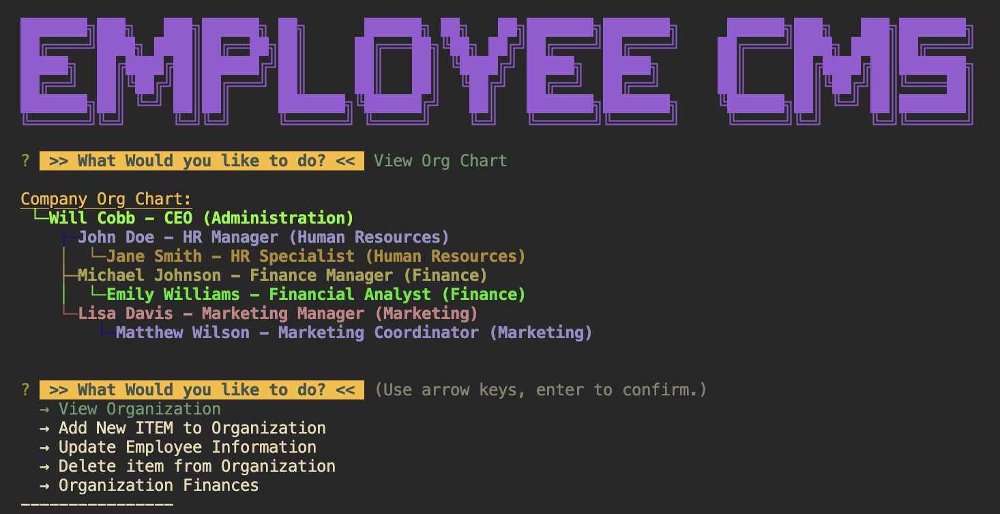

# Employee_CMS_CLI

A Node.js CLI CMS utilizing a mySQL database representative of a fictitious company.

[](https://opensource.org/licenses/MIT)



## Description 

This is a Command Line Interface Content Management System for a fictitious company showing relations between departments, roles, and employees. 

With this program you are able to perform CRUD operations on the database in a cleaver CLI. The program also utilizes queries to help keep the user on rails with choice selection rather than open queries. 

The program has fun additions such as an ASCII org chart and randomly generating colors for the responses to the selections utilizing chalk, chalk-table.

## Table of Contents

- [Installation](#installation)
- [Usage](#usage)
- [Contributions](#contributions)
- [Questions](#questions)
- [License](#license)

## Installation

```bash
npm install
```

  For installing this CLI application, you will need to have Node, Chalk, chalk-table, Inquirer(8.2.4), inquirer-tree-prompt, and mysql. utilize 'npm i' to install packages.

  You will need mysql setup on your dev device.

  mysql connections are hidden in a .env file with the following layout. Create and place your login information in this file:

  ```
  DB = <db created in employee.db>
  PASSWORD = <password>
  ```

  you will also need to source your db with employee.db and seed it with seed.db

## Usage

once packages installed, open a terminal and type the following: 

  ```bash
  node server.js
```

This will guide you through prompts to view, add, update, delete items from the company.

## Demo

[Demo Video Here](https://drive.google.com/file/d/1r5c_MswbmapKA969x3z8OtO7DxsRQdvO/view?usp=sharing)


## Contributions
  You are welcome to contribute!

## Questions
  Please reach out to me if you have any questions about the functionality of the app or installation
  [GitHub](https://github.com/1willcobb) |
  [Email](mailto:cobb.will@gmail.com)

## License
[MIT License](https://choosealicense.com/licenses/mit/)

  The license used for this application is MIT License which can be found at the [here](https://choosealicense.com/licenses/mit/)
